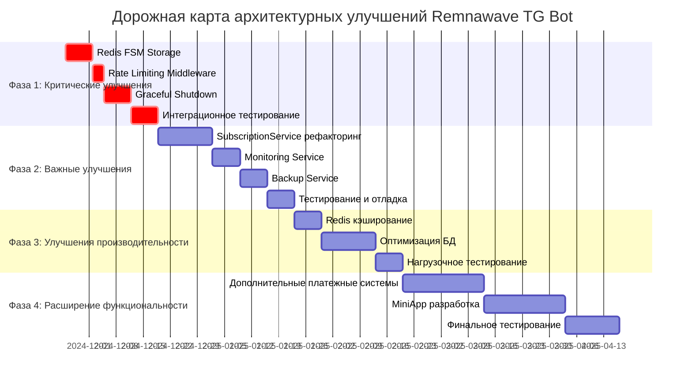

# Дорожная карта внедрения архитектурных улучшений

**Дата создания:** 24 ноября 2024  
**Версия:** 1.0  
**Статус:** Готова к реализации

---

## Обзор дорожной карты



---

## Детальный план по фазам

### Фаза 1: Критические улучшения (3 недели)

#### Неделя 1: Redis FSM Storage Migration
**Цель:** Обеспечение сохранности состояний пользователей

**Задачи:**
- [ ] **День 1-2:** Настройка Redis инфраструктуры
  - Установка Redis сервера
  - Настройка кластера для высокой доступности
  - Конфигурация безопасности и аутентификации

- [ ] **День 3-4:** Реализация StorageManager
  ```python
  # bot/core/storage.py
  class StorageManager:
      def __init__(self, redis_url: str):
          self.redis_client = redis.from_url(redis_url)
          self.fsm_storage = RedisStorage2(redis=self.redis_client)
  ```

- [ ] **День 5-7:** Интеграция и тестирование
  - Миграция текущих состояний
  - Тестирование сохранения при перезапуске
  - Нагрузочное тестирование FSM storage

**Результат:** Состояния пользователей сохраняются при перезапуске, поддержка горизонтального масштабирования

#### Неделя 2: Rate Limiting и Graceful Shutdown
**Цель:** Повышение безопасности и надежности

**Задачи:**
- [ ] **День 1-2:** Rate Limiting Middleware
  ```python
  # bot/middlewares/rate_limit.py
  class RateLimitMiddleware(BaseMiddleware):
      def __init__(self, time_limit: float = 1.0, key_limit: int = 5):
          # Реализация ограничений
  ```

- [ ] **День 3-4:** Graceful Shutdown Manager
  ```python
  # bot/core/graceful_shutdown.py
  class GracefulShutdownManager:
      def __init__(self):
          # Регистрация сигналов и cleanup задач
  ```

- [ ] **День 5-7:** Интеграция middleware
  - Регистрация в dispatcher
  - Тестирование защиты от спама
  - Тестирование корректного завершения

**Результат:** Защита от DoS-атак, корректное завершение с сохранением данных

#### Неделя 3: Интеграционное тестирование
**Цель:** Проверка работы всех улучшений вместе

**Задачи:**
- [ ] **День 1-3:** Комплексное тестирование
  - Тестирование сценариев с высокой нагрузкой
  - Проверка сохранения состояний при сбоях
  - Валидация rate limiting

- [ ] **День 4-5:** Производительное тестирование
  - Бенчмарки производительности
  - Сравнение с базовой версией
  - Оптимизация узких мест

- [ ] **День 6-7:** Подготовка к продакшену
  - Написание документации
  - Подготовка deployment скриптов
  - Создание rollback планов

**Результат:** Готовность к продакшен развертыванию критических улучшений

---

### Фаза 2: Важные улучшения (4 недели)

#### Недели 4-5: SubscriptionService рефакторинг
**Цель:** Улучшение архитектуры и поддерживаемости

**Задачи:**
- [ ] **День 1-3:** Анализ и проектирование
  - Выделение границ ответственности
  - Проектирование интерфейсов
  - Планирование миграции данных

- [ ] **День 4-8:** Реализация SubscriptionManagementService
  ```python
  # bot/services/subscription_management_service.py
  class SubscriptionManagementService:
      async def create_subscription(self, user_id: int, tariff_id: int) -> Subscription
      async def activate_subscription(self, subscription_id: int) -> bool
      async def expire_subscription(self, subscription_id: int) -> bool
  ```

- [ ] **День 9-12:** Реализация SubscriptionPricingService
  ```python
  # bot/services/subscription_pricing_service.py
  class SubscriptionPricingService:
      async def calculate_price(self, tariff_id: int, user_id: int) -> PricingResult
      async def apply_discount(self, price: int, discount: Discount) -> int
  ```

- [ ] **День 13-14:** Миграция и тестирование
  - Постепенная миграция логики
  - Обновление зависимых сервисов
  - Комплексное тестирование

**Результат:** Четкое разделение ответственности, улучшенная тестируемость

#### Неделя 6: Monitoring Service
**Цель:** Внедрение системного мониторинга

**Задачи:**
- [ ] **День 1-3:** Реализация MonitoringService
  ```python
  # bot/services/monitoring_service.py
  class MonitoringService:
      async def check_database_health(self) -> HealthCheckResult
      async def check_payment_gateways_health(self) -> Dict[str, HealthCheckResult]
      async def collect_system_metrics(self) -> Dict[str, Any]
  ```

- [ ] **День 4-5:** Интеграция health checks
  - Регистрация проверок для всех компонентов
  - Настройка алертинга
  - Интеграция с внешними системами мониторинга

- [ ] **День 6-7:** Dashboard и уведомления
  - Создание dashboard для мониторинга
  - Настройка уведомлений о критических событиях
  - Документирование метрик

**Результат:** Полная видимость состояния системы, проактивное обнаружение проблем

#### Неделя 7: Backup Service
**Цель:** Обеспечение резервного копирования и восстановления

**Задачи:**
- [ ] **День 1-3:** Реализация BackupService
  ```python
  # bot/services/backup_service.py
  class BackupService:
      async def create_backup(self, include_logs: bool = False) -> str
      async def restore_backup(self, backup_path: str) -> bool
      async def schedule_automatic_backups(self) -> None
  ```

- [ ] **День 4-5:** Автоматизация бэкапов
  - Настройка регулярных бэкапов
  - Внедрение ротации бэкапов
  - Тестирование восстановления

- [ ] **День 6-7:** Интеграция и мониторинг
  - Интеграция с основным приложением
  - Мониторинг процесса бэкапирования
  - Тестирование аварийного восстановления

**Результат:** Автоматические бэкапы, возможность быстрого восстановления

---

### Фаза 3: Улучшения производительности (3 недели)

#### Неделя 8: Redis кэширование
**Цель:** Снижение нагрузки на базу данных

**Задачи:**
- [ ] **День 1-2:** Реализация CacheManager
  ```python
  # bot/utils/cache.py
  class CacheManager:
      def cached(self, ttl: int = 300, key_prefix: str = "")
      async def invalidate_pattern(self, pattern: str)
  ```

- [ ] **День 3-4:** Кэширование критических запросов
  - Кэширование тарифов
  - Кэширование пользовательских данных
  - Кэширование результатов сложных запросов

- [ ] **День 5-7:** Оптимизация и тестирование
  - Профилирование кэша
  - Оптимизация TTL
  - Нагрузочное тестирование

**Результат:** Снижение нагрузки на БД на 30-40%, увеличение производительности

#### Недели 9-10: Оптимизация базы данных
**Цель:** Улучшение производительности запросов

**Задачи:**
- [ ] **День 1-3:** Анализ и оптимизация запросов
  - Выявление N+1 проблем
  - Оптимизация "горячих" запросов
  - Добавление недостающих индексов

- [ ] **День 4-7:** Реализация оптимизаций
  ```python
  # bot/dal/subscription_dal.py
  class SubscriptionDAL:
      @staticmethod
      async def get_user_subscriptions_with_details(
          session: AsyncSession, user_id: int
      ) -> List[Subscription]:
          # Оптимизированный запрос с eager loading
  ```

- [ ] **День 8-10:** Тестирование и валидация
  - Сравнение производительности
  - Нагрузочное тестирование
  - Мониторинг оптимизированных запросов

**Результат:** Увеличение скорости ответов на 25-35%

#### Неделя 11: Нагрузочное тестирование
**Цель:** Валидация производительности под нагрузкой

**Задачи:**
- [ ] **День 1-3:** Подготовка тестов
  - Создание нагрузочных сценариев
  - Настройка тестового окружения
  - Подготовка тестовых данных

- [ ] **День 4-5:** Проведение тестов
  - Тестирование на 1x, 5x, 10x нагрузке
  - Мониторинг производительности
  - Выявление узких мест

- [ ] **День 6-7:** Анализ и оптимизация
  - Анализ результатов тестов
  - Оптимизация найденных проблем
  - Финальная валидация

**Результат:** Подтверждение готовности к высоким нагрузкам

---

### Фаза 4: Расширение функциональности (6 недель)

#### Недели 12-14: Дополнительные платежные системы
**Цель:** Расширение выбора платежных методов

**Задачи:**
- [ ] **День 1-5:** Анализ и выбор систем
  - Исследование рынка платежных систем
  - Выбор приоритетных интеграций
  - Подготовка технических требований

- [ ] **День 6-15:** Интеграция платежных шлюзов
  ```python
  # bot/services/heleket_service.py
  class HeleketService(PaymentGateway):
      async def create_payment(self, amount: int, user_id: int) -> PaymentResult
      async def verify_webhook(self, request_data: Dict[str, Any]) -> bool
  ```

- [ ] **День 16-21:** Тестирование и запуск
  - Тестирование интеграций
  - Настройка webhook обработчиков
  - Подготовка документации

**Результат:** Расширение выбора платежных методов до 9 систем

#### Недели 15-17: MiniApp разработка
**Цель:** Создание веб-интерфейса для расширенного функционала

**Задачи:**
- [ ] **День 1-7:** Проектирование и разработка API
  ```python
  # bot/web/miniapp.py
  @miniapp.get("/api/user/subscriptions")
  async def get_user_subscriptions(token: str = Depends(security))
  
  @miniapp.post("/api/subscription/extend")
  async def extend_subscription(extension_data: dict, token: str = Depends(security))
  ```

- [ ] **День 8-14:** Разработка веб-интерфейса
  - Создание React/Vue приложения
  - Интеграция с Telegram WebApp API
  - Реализация управления подписками

- [ ] **День 15-21:** Интеграция и тестирование
  - Интеграция с основным ботом
  - Тестирование пользовательских сценариев
  - Оптимизация производительности

**Результат:** Удобный веб-интерфейс для управления подписками

#### Недели 18-19: Финальное тестирование
**Цель:** Комплексная проверка всех улучшений

**Задачи:**
- [ ] **День 1-7:** Интеграционное тестирование
  - Тестирование всех компонентов вместе
  - Проверка совместимости
  - Валидация производительности

- [ ] **День 8-14:** Подготовка к продакшену
  - Финальная оптимизация
  - Подготовка deployment планов
  - Создание документации

**Результат:** Готовность к продакшен развертыванию всех улучшений

---

## Ресурсы и команда

### Требуемая команда

| Роль | Количество | Участие в фазах |
|-------|------------|------------------|
| **Lead Developer** | 1 | Все фазы (архитектура, ключевые решения) |
| **Backend Developer** | 2-3 | Все фазы (разработка бизнес-логики) |
| **DevOps Engineer** | 1 | Фазы 1, 3 (инфраструктура, развертывание) |
| **QA Engineer** | 1 | Фазы 1, 2, 4 (тестирование) |
| **Database Administrator** | 0.5 | Фаза 3 (оптимизация БД) |

### Бюджет и временные затраты

| Фаза | Длительность | Человеко-часы | Примерная стоимость |
|-------|-------------|----------------|-------------------|
| **Фаза 1** | 3 недели | 240 часов | $12,000 |
| **Фаза 2** | 4 недели | 320 часов | $16,000 |
| **Фаза 3** | 3 недели | 240 часов | $12,000 |
| **Фаза 4** | 6 недель | 480 часов | $24,000 |
| **Итого** | 16 недель | 1,280 часов | $64,000 |

---

## Критерии успеха и метрики

### Технические метрики

| Метрика | Текущее значение | Целевое значение | Метод измерения |
|---------|----------------|------------------|-----------------|
| **Uptime** | 99.5% | 99.9% | Мониторинг доступности |
| **Response time (95th percentile)** | 500ms | 200ms | APM системы |
| **Error rate** | 0.5% | 0.1% | Логирование ошибок |
| **Database query time** | 100ms | 50ms | Профилирование БД |
| **Memory usage** | 512MB | 256MB | Мониторинг ресурсов |
| **Concurrent users** | 200 | 2000 | Нагрузочное тестирование |

### Бизнес-метрики

| Метрика | Текущее значение | Целевое значение | Метод измерения |
|---------|----------------|------------------|-----------------|
| **Conversion rate** | 10% | 15% | Аналитика платежей |
| **Customer satisfaction** | 4.0/5 | 4.5/5 | Опросы пользователей |
| **Time to resolution** | 8 часов | 4 часа | Система тикетов |
| **Revenue growth** | 10% в квартал | 20% в квартал | Финансовая аналитика |
| **Support tickets** | 50 в день | 25 в день | Система поддержки |

---

## Риск-менеджмент

### Технические риски

| Риск | Вероятность | Влияние | Митигация |
|-------|-------------|----------|------------|
| **Redis отказ** | Средняя | Высокое | Redis Cluster + fallback |
| **Потеря данных при миграции** | Низкая | Критическое | Полные бэкапы + тестирование |
| **Деградация производительности** | Средняя | Среднее | Постепенное внедрение + мониторинг |
| **Проблемы совместимости** | Низкая | Среднее | Тестирование на staging |

### Бизнес-риски

| Риск | Вероятность | Влияние | Митигация |
|-------|-------------|----------|------------|
| **Простой при развертывании** | Средняя | Высокое | Blue-green deployment |
| **Кривая обучения команды** | Средняя | Среднее | Документация + обучение |
| **Зависимость от поставщиков** | Низкая | Среднее | Абстракции + альтернативы |

---

## План отката

### Критерии отката

- Снижение uptime ниже 99%
- Увеличение error rate выше 0.5%
- Деградация производительности > 50%
- Критические ошибки безопасности

### Процедура отката

1. **Немедленный откат (0-30 минут):**
   - Откат последнего deployment
   - Восстановление из бэкапа БД
   - Проверка функциональности

2. **Плановый откат (30 минут - 2 часа):**
   - Анализ проблем
   - Создание hotfix
   - Тестирование исправления

3. **Полный откат (2+ часа):**
   - Возврат к предыдущей стабильной версии
   - Полное восстановление данных
   - Пост-мортер анализ

---

## Заключение

Дорожная карта представляет собой комплексный план эволюции архитектуры Telegram-бота Remnawave. Пошаговый подход с четкими критериями успеха и планами митигации рисков обеспечивает безопасную и предсказуемую трансформацию системы.

**Ключевые преимущества дорожной карты:**
1. **Поэтапность** - постепенное внедрение без резких изменений
2. **Измеримость** - четкие метрики успеха для каждого этапа
3. **Гибкость** - возможность адаптации под изменяющиеся требования
4. **Минимальные риски** - планы отката и митигации для каждого этапа

Рекомендуется начать с Фазы 1 как наиболее критичной для надежности и безопасности системы.

---

**Дата создания дорожной карты:** 24 ноября 2024
**Версия:** 1.0
**Статус:** Готова к реализации