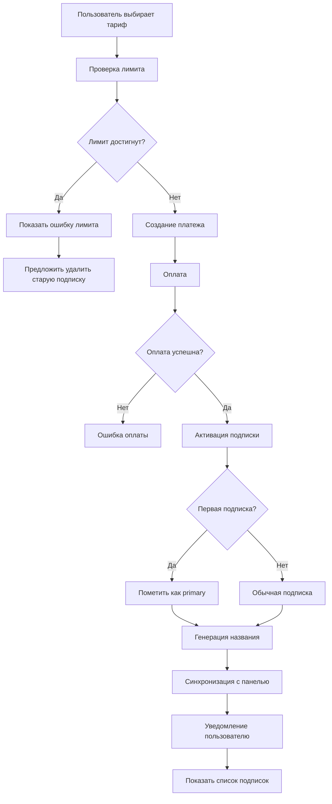
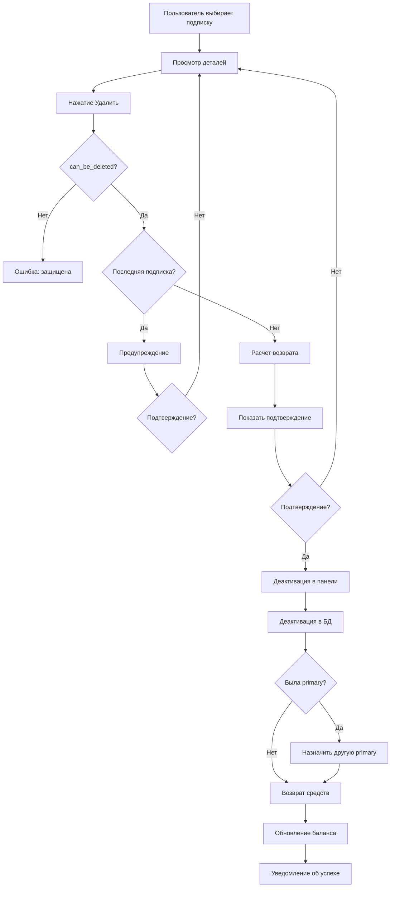
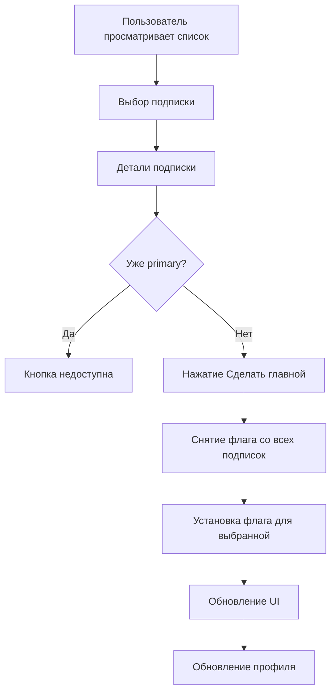

# Технический дизайн: Система множественных подписок с персональными лимитами

## 1. ОБЗОР СИСТЕМЫ

### 1.1 Текущее состояние
- ✅ Модель [`Subscription`](db/models.py:98) технически поддерживает множественные подписки
- ❌ При создании подписки деактивируются ВСЕ остальные ([`subscription_service.py:537`](bot/services/subscription_service.py:537))
- ❌ Нет UI для управления несколькими подписками
- ❌ Нет персональных лимитов на количество подписок

### 1.2 Целевое состояние
- Пользователь может иметь несколько активных подписок одновременно
- Админ управляет лимитами для каждого пользователя
- Админ может задавать custom лимиты для конкретных подписок
- Одна подписка помечена как "главная" (primary)
- UI для просмотра и управления всеми подписками

---

## 2. ИЗМЕНЕНИЯ В МОДЕЛИ ДАННЫХ

### 2.1 Расширение модели User

```python
class User(Base):
    __tablename__ = "users"
    
    # Существующие поля...
    
    # НОВЫЕ ПОЛЯ:
    max_subscriptions_limit = Column(Integer, default=1, nullable=False)
    # Комментарий:
    # - По умолчанию 1 подписка для обычных пользователей
    # - Админ может увеличить до 3, 5, 10 для VIP
    # - 0 = безлимит (только для особых случаев)
```

**Обоснование:**
- `nullable=False` с `default=1` гарантирует обратную совместимость
- Индекс не нужен - используется только для проверки при покупке
- Поле на уровне пользователя позволяет гибко управлять лимитами

### 2.2 Расширение модели Subscription

```python
class Subscription(Base):
    __tablename__ = "subscriptions"
    
    # Существующие поля...
    
    # НОВЫЕ ПОЛЯ:
    custom_traffic_limit_bytes = Column(BigInteger, nullable=True)
    # Переопределяет traffic_limit_bytes из тарифа
    # NULL = использовать лимит тарифа или дефолтный
    
    custom_device_limit = Column(Integer, nullable=True)
    # Переопределяет device_limit из тарифа
    # NULL = использовать лимит тарифа или дефолтный
    
    subscription_name = Column(String(100), nullable=True)
    # Пользовательское название для различия подписок
    # Генерируется автоматически, но может быть изменено админом
    # Например: "Основная", "Для семьи", "Офис"
    
    is_primary = Column(Boolean, default=False, index=True, nullable=False)
    # Главная подписка (отображается в профиле)
    # У пользователя может быть только одна primary подписка
    
    can_be_deleted = Column(Boolean, default=True, nullable=False)
    # Защита от случайного удаления
    # Админ может установить False для критичных подписок
```

**Индексы:**
```python
# Composite index для быстрого поиска главной подписки
Index('ix_subscriptions_user_id_is_primary', 'user_id', 'is_primary')
```

**Обоснование:**
- `custom_*` поля nullable - позволяют наследовать значения из тарифа
- `is_primary` с индексом - быстрый поиск главной подписки
- `can_be_deleted` - защита от ошибок, по умолчанию True для гибкости
- `subscription_name` - для UX, чтобы пользователь различал подписки

### 2.3 DDL для миграции

```sql
-- Миграция: 003_add_multiple_subscriptions_support.py

-- ALTER TABLE users
ALTER TABLE users 
ADD COLUMN max_subscriptions_limit INTEGER NOT NULL DEFAULT 1;

-- ALTER TABLE subscriptions
ALTER TABLE subscriptions 
ADD COLUMN custom_traffic_limit_bytes BIGINT NULL,
ADD COLUMN custom_device_limit INTEGER NULL,
ADD COLUMN subscription_name VARCHAR(100) NULL,
ADD COLUMN is_primary BOOLEAN NOT NULL DEFAULT FALSE,
ADD COLUMN can_be_deleted BOOLEAN NOT NULL DEFAULT TRUE;

-- Создание индекса для is_primary
CREATE INDEX ix_subscriptions_user_id_is_primary 
ON subscriptions(user_id, is_primary);

-- Обновление существующих записей
-- Помечаем самую свежую активную подписку каждого пользователя как primary
WITH ranked_subs AS (
    SELECT 
        subscription_id,
        ROW_NUMBER() OVER (
            PARTITION BY user_id 
            ORDER BY end_date DESC, subscription_id DESC
        ) as rn
    FROM subscriptions
    WHERE is_active = TRUE
)
UPDATE subscriptions 
SET is_primary = TRUE
WHERE subscription_id IN (
    SELECT subscription_id FROM ranked_subs WHERE rn = 1
);

-- Генерация названий для существующих подписок
UPDATE subscriptions 
SET subscription_name = 
    CASE 
        WHEN is_primary THEN 'Основная подписка'
        ELSE 'Подписка #' || subscription_id
    END
WHERE subscription_name IS NULL;
```

---

## 3. БИЗНЕС-ЛОГИКА МНОЖЕСТВЕННЫХ ПОДПИСОК

### 3.1 Логика активации подписки

**Текущая логика (ПРОБЛЕМА):**
```python
# bot/services/subscription_service.py:537
await subscription_dal.deactivate_other_active_subscriptions(
    session, panel_user_uuid, panel_sub_link_id
)
```

**Новая логика:**
```python
async def activate_subscription(
    self,
    session: AsyncSession,
    user_id: int,
    months: int,
    payment_amount: float,
    payment_db_id: int,
    promo_code_id_from_payment: Optional[int] = None,
    provider: str = "yookassa",
    tariff_id: Optional[int] = None,
) -> Optional[Dict[str, Any]]:
    """
    Активировать подписку для пользователя.
    ИЗМЕНЕНО: Теперь НЕ деактивирует другие подписки, если лимит не превышен.
    """
    db_user = await user_dal.get_user_by_id(session, user_id)
    if not db_user:
        logging.error(f"User {user_id} not found")
        return None
    
    # НОВАЯ ПРОВЕРКА: Проверка лимита подписок
    active_subs_count = await subscription_dal.count_active_subscriptions(session, user_id)
    max_limit = db_user.max_subscriptions_limit
    
    if max_limit > 0 and active_subs_count >= max_limit:
        logging.warning(
            f"User {user_id} reached subscription limit: {active_subs_count}/{max_limit}"
        )
        return {
            "error": "subscription_limit_reached",
            "current_count": active_subs_count,
            "max_limit": max_limit
        }
    
    # Получаем тариф, если указан
    tariff: Optional[Tariff] = None
    if tariff_id:
        tariff = await tariff_dal.get_tariff_by_id(session, tariff_id)
        # ... валидация тарифа
    
    # Панель API логика
    panel_user_uuid, panel_sub_link_id, panel_short_uuid, panel_user_created_now = (
        await self._get_or_create_panel_user_link_details(session, user_id, db_user)
    )
    
    if not panel_user_uuid or not panel_sub_link_id:
        logging.error(f"Failed to ensure panel user for TG {user_id}")
        return None
    
    # Вычисление дат
    start_date = datetime.now(timezone.utc)
    
    # ИЗМЕНЕНО: НЕ продлеваем с текущей подписки, новая подписка независима
    # Каждая подписка имеет свой срок
    
    # Определяем продолжительность
    if tariff:
        duration_days_total = tariff.duration_days
    else:
        end_after_months = add_months(start_date, months)
        duration_days_total = (end_after_months - start_date).days
    
    # Применение промокода
    applied_promo_bonus_days = 0
    if promo_code_id_from_payment:
        # ... логика промокода
        pass
    
    final_end_date = start_date + timedelta(days=duration_days_total)
    
    # ИЗМЕНЕНО: НЕ деактивируем другие подписки!
    # await subscription_dal.deactivate_other_active_subscriptions(...)  # УДАЛЕНО
    
    # Определяем, является ли эта подписка первой
    is_first_subscription = active_subs_count == 0
    
    # Автопродление
    auto_renew_should_enable = False
    if provider == "yookassa" and getattr(self.settings, "YOOKASSA_AUTOPAYMENTS_ENABLED", False):
        auto_renew_should_enable = await user_billing_dal.user_has_saved_payment_method(
            session, user_id
        )
    
    # Лимиты трафика и устройств
    traffic_limit_bytes = (
        tariff.traffic_limit_bytes if tariff and tariff.traffic_limit_bytes is not None
        else self.settings.user_traffic_limit_bytes
    )
    device_limit = tariff.device_limit if tariff else None
    
    # Генерация названия подписки
    subscription_name = await self._generate_subscription_name(
        session, user_id, tariff, active_subs_count
    )
    
    # Создание подписки
    sub_payload = {
        "user_id": user_id,
        "tariff_id": tariff_id,
        "panel_user_uuid": panel_user_uuid,
        "panel_subscription_uuid": panel_sub_link_id,
        "start_date": start_date,
        "end_date": final_end_date,
        "duration_months": months if not tariff else 0,
        "is_active": True,
        "status_from_panel": "ACTIVE",
        "traffic_limit_bytes": traffic_limit_bytes,
        "provider": provider,
        "skip_notifications": provider == "tribute" and self.settings.TRIBUTE_SKIP_NOTIFICATIONS,
        "auto_renew_enabled": auto_renew_should_enable,
        # НОВЫЕ ПОЛЯ:
        "subscription_name": subscription_name,
        "is_primary": is_first_subscription,  # Первая подписка = главная
        "can_be_deleted": True,
    }
    
    try:
        new_sub = await subscription_dal.upsert_subscription(session, sub_payload)
    except Exception as e:
        logging.error(f"Failed to upsert subscription: {e}", exc_info=True)
        return None
    
    # Обновление панели (НЕ меняется)
    panel_update_payload = self._build_panel_update_payload(
        panel_user_uuid=panel_user_uuid,
        expire_at=final_end_date,
        status="ACTIVE",
        traffic_limit_bytes=traffic_limit_bytes,
        device_limit=device_limit,
    )
    
    # ... остальная логика панели
    
    return {
        "subscription_id": new_sub.subscription_id,
        "end_date": final_end_date,
        "is_active": True,
        "panel_user_uuid": panel_user_uuid,
        "panel_short_uuid": panel_short_uuid,
        "subscription_url": final_subscription_url,
        "applied_promo_bonus_days": applied_promo_bonus_days,
        "is_primary": is_first_subscription,
        "subscription_name": subscription_name,
    }


async def _generate_subscription_name(
    self,
    session: AsyncSession,
    user_id: int,
    tariff: Optional[Tariff],
    current_count: int,
) -> str:
    """Генерирует название для новой подписки"""
    if current_count == 0:
        return "Основная подписка"
    
    if tariff:
        return f"{tariff.name} #{current_count + 1}"
    
    return f"Подписка #{current_count + 1}"
```

### 3.2 Проверка лимита перед покупкой

```python
# Новый метод в SubscriptionService
async def check_subscription_limit(
    self,
    session: AsyncSession,
    user_id: int,
) -> Dict[str, Any]:
    """
    Проверяет, может ли пользователь купить новую подписку.
    
    Returns:
        {
            "can_purchase": bool,
            "current_count": int,
            "max_limit": int,
            "remaining": int
        }
    """
    user = await user_dal.get_user_by_id(session, user_id)
    if not user:
        return {
            "can_purchase": False,
            "current_count": 0,
            "max_limit": 0,
            "remaining": 0,
            "error": "user_not_found"
        }
    
    active_count = await subscription_dal.count_active_subscriptions(session, user_id)
    max_limit = user.max_subscriptions_limit
    
    # 0 = безлимит
    if max_limit == 0:
        return {
            "can_purchase": True,
            "current_count": active_count,
            "max_limit": 0,
            "remaining": -1,  # безлимит
        }
    
    remaining = max_limit - active_count
    
    return {
        "can_purchase": remaining > 0,
        "current_count": active_count,
        "max_limit": max_limit,
        "remaining": remaining,
    }
```

### 3.3 Логика удаления подписки

```python
# Новый метод в SubscriptionService
async def delete_subscription(
    self,
    session: AsyncSession,
    subscription_id: int,
    user_id: int,
    admin_override: bool = False,
) -> Dict[str, Any]:
    """
    Удаляет подписку с возможным возвратом средств.
    
    Args:
        subscription_id: ID подписки для удаления
        user_id: ID пользователя (для проверки владения)
        admin_override: Админ может удалить защищенные подписки
        
    Returns:
        {
            "success": bool,
            "refund_amount": float,
            "message": str
        }
    """
    # Получаем подписку
    sub = await subscription_dal.get_subscription_by_id(session, subscription_id)
    
    if not sub:
        return {"success": False, "message": "subscription_not_found"}
    
    # Проверка владения
    if sub.user_id != user_id and not admin_override:
        return {"success": False, "message": "access_denied"}
    
    # Проверка can_be_deleted
    if not sub.can_be_deleted and not admin_override:
        return {"success": False, "message": "subscription_protected"}
    
    # Проверка: нельзя удалить последнюю подписку (опционально)
    active_subs = await subscription_dal.get_active_subscriptions_for_user(session, user_id)
    if len(active_subs) == 1 and not admin_override:
        return {"success": False, "message": "cannot_delete_last_subscription"}
    
    # Расчет возврата (пропорционально оставшемуся времени)
    refund_amount = 0.0
    now = datetime.now(timezone.utc)
    
    if sub.end_date > now and sub.start_date:
        # Подписка еще активна
        total_duration = (sub.end_date - sub.start_date).total_seconds()
        remaining_duration = (sub.end_date - now).total_seconds()
        
        if total_duration > 0:
            remaining_percentage = remaining_duration / total_duration
            
            # Ищем платеж для этой подписки
            payment = await payment_dal.get_payment_for_subscription(
                session, user_id, subscription_id
            )
            
            if payment and remaining_percentage > 0.1:  # возврат только если >10% времени
                refund_amount = payment.amount * remaining_percentage
                
                # Создаем возврат в балансе
                await balance_dal.add_balance_operation(
                    session,
                    user_id=user_id,
                    amount=refund_amount,
                    operation_type="refund",
                    description=f"Возврат за удаление подписки #{subscription_id}",
                )
                
                # Обновляем баланс пользователя
                await user_dal.update_user(
                    session,
                    user_id,
                    {"balance": sub.user.balance + refund_amount}
                )
    
    # Удаляем подписку из панели
    if sub.panel_user_uuid:
        try:
            await self.panel_service.deactivate_user_subscription(sub.panel_user_uuid)
        except Exception as e:
            logging.error(f"Failed to deactivate panel subscription: {e}")
    
    # Деактивируем подписку в БД
    await subscription_dal.update_subscription(
        session,
        subscription_id,
        {
            "is_active": False,
            "status_from_panel": "DELETED_BY_USER",
        }
    )
    
    # Если удалена primary подписка, назначить другую
    if sub.is_primary:
        await self._reassign_primary_subscription(session, user_id, subscription_id)
    
    return {
        "success": True,
        "refund_amount": refund_amount,
        "message": "subscription_deleted_successfully",
    }


async def _reassign_primary_subscription(
    self,
    session: AsyncSession,
    user_id: int,
    deleted_sub_id: int,
) -> None:
    """Назначает новую главную подписку после удаления текущей главной"""
    # Получаем активные подписки кроме удаленной
    active_subs = await subscription_dal.get_active_subscriptions_for_user(session, user_id)
    active_subs = [s for s in active_subs if s.subscription_id != deleted_sub_id]
    
    if active_subs:
        # Назначаем primary самой свежей подписке
        newest_sub = max(active_subs, key=lambda s: s.end_date)
        await subscription_dal.update_subscription(
            session,
            newest_sub.subscription_id,
            {"is_primary": True}
        )
        logging.info(f"Reassigned primary to subscription {newest_sub.subscription_id}")
```

### 3.4 Установка главной подписки

```python
# Новый метод в SubscriptionService
async def set_primary_subscription(
    self,
    session: AsyncSession,
    subscription_id: int,
    user_id: int,
) -> bool:
    """Делает подписку главной"""
    sub = await subscription_dal.get_subscription_by_id(session, subscription_id)
    
    if not sub or sub.user_id != user_id:
        return False
    
    if not sub.is_active:
        return False
    
    # Снимаем is_primary со всех других подписок
    await subscription_dal.clear_primary_flag_for_user(session, user_id)
    
    # Устанавливаем для выбранной
    await subscription_dal.update_subscription(
        session,
        subscription_id,
        {"is_primary": True}
    )
    
    return True
```

---

## 4. ИЗМЕНЕНИЯ В DAL (subscription_dal.py)

```python
# Новые методы в subscription_dal.py

async def count_active_subscriptions(
    session: AsyncSession,
    user_id: int,
) -> int:
    """Подсчитывает количество активных подписок пользователя"""
    now = datetime.now(timezone.utc)
    stmt = select(func.count(Subscription.subscription_id)).where(
        Subscription.user_id == user_id,
        Subscription.is_active == True,
        Subscription.end_date > now,
    )
    result = await session.execute(stmt)
    return result.scalar() or 0


async def get_all_active_subscriptions_for_user(
    session: AsyncSession,
    user_id: int,
) -> List[Subscription]:
    """Получает все активные подписки пользователя с тарифами"""
    now = datetime.now(timezone.utc)
    stmt = (
        select(Subscription)
        .options(selectinload(Subscription.tariff))
        .where(
            Subscription.user_id == user_id,
            Subscription.is_active == True,
            Subscription.end_date > now,
        )
        .order_by(
            Subscription.is_primary.desc(),  # Primary первая
            Subscription.end_date.desc()
        )
    )
    result = await session.execute(stmt)
    return result.scalars().all()


async def get_primary_subscription(
    session: AsyncSession,
    user_id: int,
) -> Optional[Subscription]:
    """Получает главную подписку пользователя"""
    now = datetime.now(timezone.utc)
    stmt = select(Subscription).where(
        Subscription.user_id == user_id,
        Subscription.is_active == True,
        Subscription.is_primary == True,
        Subscription.end_date > now,
    ).limit(1)
    result = await session.execute(stmt)
    return result.scalars().first()


async def clear_primary_flag_for_user(
    session: AsyncSession,
    user_id: int,
) -> None:
    """Снимает флаг is_primary со всех подписок пользователя"""
    stmt = (
        update(Subscription)
        .where(Subscription.user_id == user_id)
        .values(is_primary=False)
    )
    await session.execute(stmt)


async def get_subscription_by_id(
    session: AsyncSession,
    subscription_id: int,
) -> Optional[Subscription]:
    """Получает подписку по ID"""
    stmt = select(Subscription).where(
        Subscription.subscription_id == subscription_id
    )
    result = await session.execute(stmt)
    return result.scalars().first()
```

---

## 5. UI / KEYBOARDS

### 5.1 Список подписок пользователя

```python
# bot/keyboards/inline/user_keyboards.py

def get_subscriptions_list_keyboard(
    subscriptions: List[Subscription],
    lang: str,
    i18n_instance,
) -> InlineKeyboardMarkup:
    """Клавиатура со списком всех подписок пользователя"""
    _ = lambda key, **kwargs: i18n_instance.gettext(lang, key, **kwargs)
    builder = InlineKeyboardBuilder()
    
    for sub in subscriptions:
        # Формируем текст кнопки
        status_emoji = "⭐" if sub.is_primary else "📦"
        
        # Название с информацией
        days_left = (sub.end_date - datetime.now(timezone.utc)).days
        button_text = f"{status_emoji} {sub.subscription_name or 'Подписка'} ({days_left} дн.)"
        
        builder.row(
            InlineKeyboardButton(
                text=button_text,
                callback_data=f"subscription:view:{sub.subscription_id}"
            )
        )
    
    # Кнопка "Купить еще"
    builder.row(
        InlineKeyboardButton(
            text=_("subscriptions_buy_more_button"),
            callback_data="main_action:subscribe"
        )
    )
    
    # Назад в главное меню
    builder.row(
        InlineKeyboardButton(
            text=_("back_to_main_menu_button"),
            callback_data="main_action:back_to_main"
        )
    )
    
    return builder.as_markup()


def get_subscription_detail_keyboard(
    subscription: Subscription,
    is_primary: bool,
    can_delete: bool,
    lang: str,
    i18n_instance,
) -> InlineKeyboardMarkup:
    """Клавиатура детальной страницы подписки"""
    _ = lambda key, **kwargs: i18n_instance.gettext(lang, key, **kwargs)
    builder = InlineKeyboardBuilder()
    
    # Кнопка "Сделать главной" (если еще не главная)
    if not is_primary:
        builder.row(
            InlineKeyboardButton(
                text=_("subscription_set_primary_button"),
                callback_data=f"subscription:set_primary:{subscription.subscription_id}"
            )
        )
    
    # Кнопка удаления (если можно удалить)
    if can_delete:
        builder.row(
            InlineKeyboardButton(
                text=_("subscription_delete_button"),
                callback_data=f"subscription:delete_confirm:{subscription.subscription_id}"
            )
        )
    
    # Назад к списку
    builder.row(
        InlineKeyboardButton(
            text=_("back_to_subscriptions_list_button"),
            callback_data="subscription:list"
        )
    )
    
    return builder.as_markup()


def get_subscription_delete_confirm_keyboard(
    subscription_id: int,
    refund_amount: float,
    lang: str,
    i18n_instance,
) -> InlineKeyboardMarkup:
    """Клавиатура подтверждения удаления подписки"""
    _ = lambda key, **kwargs: i18n_instance.gettext(lang, key, **kwargs)
    builder = InlineKeyboardBuilder()
    
    # Кнопка подтверждения
    builder.row(
        InlineKeyboardButton(
            text=_("yes_delete_button"),
            callback_data=f"subscription:delete:{subscription_id}"
        )
    )
    
    # Кнопка отмены
    builder.row(
        InlineKeyboardButton(
            text=_("cancel_button"),
            callback_data=f"subscription:view:{subscription_id}"
        )
    )
    
    return builder.as_markup()
```

### 5.2 Обновление главного меню

```python
# Изменение в bot/keyboards/inline/user_keyboards.py

def get_main_menu_inline_keyboard(
    lang: str,
    i18n_instance,
    settings: Settings,
    show_trial_button: bool = False,
    subscriptions_count: int = 0,  # НОВЫЙ ПАРАМЕТР
) -> InlineKeyboardMarkup:
    _ = lambda key, **kwargs: i18n_instance.gettext(lang, key, **kwargs)
    builder = InlineKeyboardBuilder()

    # ... существующие кнопки
    
    # ИЗМЕНЕНО: Кнопка "Мои подписки" с количеством
    my_subs_text = _("menu_my_subscription_inline")
    if subscriptions_count > 1:
        my_subs_text = _("menu_my_subscriptions_inline", count=subscriptions_count)
    
    builder.row(
        InlineKeyboardButton(
            text=my_subs_text,
            callback_data="subscription:list"  # ИЗМЕНЕНО: теперь показывает список
        )
    )
    
    # ... остальные кнопки
```

---

## 6. HANDLERS (обработчики)

### 6.1 Список подписок

```python
# bot/handlers/user/subscriptions_management.py (НОВЫЙ ФАЙЛ)

@router.callback_query(F.data == "subscription:list")
async def show_subscriptions_list(
    callback: types.CallbackQuery,
    session: AsyncSession,
    settings: Settings,
    i18n_data: dict,
    subscription_service: SubscriptionService,
):
    """Показывает список всех подписок пользователя"""
    user_id = callback.from_user.id
    current_lang = i18n_data.get("current_language", settings.DEFAULT_LANGUAGE)
    i18n: Optional[JsonI18n] = i18n_data.get("i18n_instance")
    
    if not i18n:
        await callback.answer("Service error", show_alert=True)
        return
    
    _ = lambda key, **kwargs: i18n.gettext(current_lang, key, **kwargs)
    
    try:
        # Получаем все активные подписки
        subscriptions = await subscription_dal.get_all_active_subscriptions_for_user(
            session, user_id
        )
        
        if not subscriptions:
            await callback.message.edit_text(
                _("subscriptions_none_active"),
                reply_markup=get_back_to_main_menu_markup(current_lang, i18n)
            )
            return
        
        # Формируем текст с информацией о подписках
        lines = [
            f"📦 <b>{_('subscriptions_list_title')}</b>\n",
            _("subscriptions_count", count=len(subscriptions)),
        ]
        
        # Информация о лимите
        user = await user_dal.get_user_by_id(session, user_id)
        if user:
            limit_text = _("subscriptions_unlimited") if user.max_subscriptions_limit == 0 else str(user.max_subscriptions_limit)
            lines.append(_("subscriptions_limit_info", current=len(subscriptions), max=limit_text))
        
        lines.append("\n" + _("subscriptions_select_to_view"))
        
        text = "\n".join(lines)
        keyboard = get_subscriptions_list_keyboard(subscriptions, current_lang, i18n)
        
        await callback.message.edit_text(
            text,
            reply_markup=keyboard,
            parse_mode="HTML"
        )
        await callback.answer()
        
    except Exception as e:
        logging.error(f"Error showing subscriptions list: {e}", exc_info=True)
        await callback.answer(_("error_occurred_try_again"), show_alert=True)
```

### 6.2 Детали подписки

```python
@router.callback_query(F.data.startswith("subscription:view:"))
async def show_subscription_detail(
    callback: types.CallbackQuery,
    session: AsyncSession,
    settings: Settings,
    i18n_data: dict,
    subscription_service: SubscriptionService,
):
    """Показывает детальную информацию о подписке"""
    user_id = callback.from_user.id
    current_lang = i18n_data.get("current_language", settings.DEFAULT_LANGUAGE)
    i18n: Optional[JsonI18n] = i18n_data.get("i18n_instance")
    
    if not i18n:
        await callback.answer("Service error", show_alert=True)
        return
    
    _ = lambda key, **kwargs: i18n.gettext(current_lang, key, **kwargs)
    
    try:
        # Извлекаем ID подписки
        subscription_id = int(callback.data.split(":")[-1])
        
        # Получаем подписку
        sub = await subscription_dal.get_subscription_by_id(session, subscription_id)
        
        if not sub or sub.user_id != user_id:
            await callback.answer(_("subscription_not_found"), show_alert=True)
            return
        
        # Формируем детальную информацию
        now = datetime.now(timezone.utc)
        days_left = max(0, (sub.end_date - now).days)
        
        lines = [
            f"📦 <b>{sub.subscription_name or _('subscription_unnamed')}</b>\n",
        ]
        
        if sub.is_primary:
            lines.append(f"⭐ <b>{_('subscription_primary_badge')}</b>\n")
        
        lines.extend([
            f"📅 <b>{_('subscription_end_date')}:</b> {format_date(sub.end_date)}",
            f"⏳ <b>{_('subscription_days_left')}:</b> {days_left} {_('days')}",
        ])
        
        # Информация о трафике
        if sub.custom_traffic_limit_bytes:
            traffic_gb = sub.custom_traffic_limit_bytes / (1024**3)
            lines.append(f"📊 <b>{_('subscription_traffic_limit')}:</b> {traffic_gb:.0f} GB (custom)")
        elif sub.traffic_limit_bytes:
            traffic_gb = sub.traffic_limit_bytes / (1024**3)
            lines.append(f"📊 <b>{_('subscription_traffic_limit')}:</b> {traffic_gb:.0f} GB")
        
        # Информация об устройствах
        if sub.custom_device_limit:
            lines.append(f"📱 <b>{_('subscription_device_limit')}:</b> {sub.custom_device_limit} (custom)")
        elif sub.tariff and sub.tariff.device_limit:
            lines.append(f"📱 <b>{_('subscription_device_limit')}:</b> {sub.tariff.device_limit}")
        
        # Информация о тарифе
        if sub.tariff:
            lines.append(f"\n💎 <b>{_('subscription_tariff')}:</b> {sub.tariff.name}")
        
        # Статус
        status_emoji = "✅" if sub.is_active and sub.end_date > now else "❌"
        lines.append(f"\n{status_emoji} <b>{_('subscription_status')}:</b> {sub.status_from_panel or 'ACTIVE'}")
        
        text = "\n".join(lines)
        keyboard = get_subscription_detail_keyboard(
            sub, sub.is_primary, sub.can_be_deleted, current_lang, i18n
        )
        
        await callback.message.edit_text(
            text,
            reply_markup=keyboard,
            parse_mode="HTML"
        )
        await callback.answer()
        
    except Exception as e:
        logging.error(f"Error showing subscription detail: {e}", exc_info=True)
        await callback.answer(_("error_occurred_try_again"), show_alert=True)
```

### 6.3 Удаление подписки

```python
@router.callback_query(F.data.startswith("subscription:delete_confirm:"))
async def confirm_subscription_delete(
    callback: types.CallbackQuery,
    session: AsyncSession,
    settings: Settings,
    i18n_data: dict,
    subscription_service: SubscriptionService,
):
    """Показывает подтверждение удаления подписки"""
    user_id = callback.from_user.id
    current_lang = i18n_data.get("current_language", settings.DEFAULT_LANGUAGE)
    i18n: Optional[JsonI18n] = i18n_data.get("i18n_instance")
    
    if not i18n:
        await callback.answer("Service error", show_alert=True)
        return
    
    _ = lambda key, **kwargs: i18n.gettext(current_lang, key, **kwargs)
    
    try:
        subscription_id = int(callback.data.split(":")[-1])
        sub = await subscription_dal.get_subscription_by_id(session, subscription_id)
        
        if not sub or sub.user_id != user_id:
            await callback.answer(_("subscription_not_found"), show_alert=True)
            return
        
        if not sub.can_be_deleted:
            await callback.answer(_("subscription_cannot_be_deleted"), show_alert=True)
            return
        
        # Расчет возврата
        now = datetime.now(timezone.utc)
        refund_amount = 0.0
        
        if sub.end_date > now and sub.start_date:
            total_duration = (sub.end_date - sub.start_date).total_seconds()
            remaining_duration = (sub.end_date - now).total_seconds()
            
            if total_duration > 0:
                remaining_percentage = remaining_duration / total_duration
                
                # Примерная сумма возврата (точная будет в сервисе)
                payment = await payment_dal.get_payment_for_subscription(
                    session, user_id, subscription_id
                )
                if payment and remaining_percentage > 0.1:
                    refund_amount = payment.amount * remaining_percentage
        
        # Формируем текст подтверждения
        lines = [
            f"⚠️ <b>{_('subscription_delete_confirm_title')}</b>\n",
            _("subscription_delete_confirm_text", name=sub.subscription_name or _('subscription_unnamed')),
        ]
        
        if refund_amount > 0:
            lines.append(f"\n💰 {_('subscription_delete_refund_info', amount=refund_amount:.2f)}")
        else:
            lines.append(f"\n{_('subscription_delete_no_refund')}")
        
        lines.append(f"\n{_('subscription_delete_confirm_question')}")
        
        text = "\n".join(lines)
        keyboard = get_subscription_delete_confirm_keyboard(
            subscription_id, refund_amount, current_lang, i18n
        )
        
        await callback.message.edit_text(
            text,
            reply_markup=keyboard,
            parse_mode="HTML"
        )
        await callback.answer()
        
    except Exception as e:
        logging.error(f"Error in delete confirmation: {e}", exc_info=True)
        await callback.answer(_("error_occurred_try_again"), show_alert=True)


@router.callback_query(F.data.startswith("subscription:delete:"))
async def delete_subscription_handler(
    callback: types.CallbackQuery,
    session: AsyncSession,
    settings: Settings,
    i18n_data: dict,
    subscription_service: SubscriptionService,
):
    """Выполняет удаление подписки"""
    user_id = callback.from_user.id
    current_lang = i18n_data.get("current_language", settings.DEFAULT_LANGUAGE)
    i18n: Optional[JsonI18n] = i18n_data.get("i18n_instance")
    
    if not i18n:
        await callback.answer("Service error", show_alert=True)
        return
    
    _ = lambda key, **kwargs: i18n.gettext(current_lang, key, **kwargs)
    
    try:
        subscription_id = int(callback.data.split(":")[-1])
        
        # Удаляем подписку
        result = await subscription_service.delete_subscription(
            session, subscription_id, user_id, admin_override=False
        )
        
        if not result["success"]:
            error_msg = _("subscription_delete_error_" + result["message"])
            await callback.answer(error_msg, show_alert=True)
            return
        
        # Формируем сообщение об успехе
        msg = _("subscription_deleted_success")
        if result["refund_amount"] > 0:
            msg += f"\n💰 {_('subscription_refund_credited', amount=result['refund_amount']:.2f)}"
        
        await callback.message.edit_text(
            msg,
            reply_markup=get_back_to_main_menu_markup(current_lang, i18n),
            parse_mode="HTML"
        )
        await callback.answer(_("subscription_deleted"), show_alert=True)
        
        await session.commit()
        
    except Exception as e:
        logging.error(f"Error deleting subscription: {e}", exc_info=True)
        await callback.answer(_("error_occurred_try_again"), show_alert=True)
        await session.rollback()
```

---

## 7. АДМИН-ФУНКЦИИ

### 7.1 Установка лимита подписок для пользователя

```python
# bot/handlers/admin/subscription_limits.py (НОВЫЙ ФАЙЛ)

@router.callback_query(F.data.startswith("admin:set_sub_limit:"))
async def admin_set_subscription_limit(
    callback: types.CallbackQuery,
    session: AsyncSession,
    settings: Settings,
    i18n_data: dict,
):
    """Админ устанавливает лимит подписок для пользователя"""
    admin_id = callback.from_user.id
    current_lang = i18n_data.get("current_language", settings.DEFAULT_LANGUAGE)
    i18n: Optional[JsonI18n] = i18n_data.get("i18n_instance")
    
    if not i18n:
        await callback.answer("Service error", show_alert=True)
        return
    
    _ = lambda key, **kwargs: i18n.gettext(current_lang, key, **kwargs)
    
    try:
        # Формат: admin:set_sub_limit:<user_id>:<limit>
        parts = callback.data.split(":")
        user_id = int(parts[2])
        new_limit = int(parts[3])
        
        # Обновляем лимит
        user = await user_dal.update_user(
            session,
            user_id,
            {"max_subscriptions_limit": new_limit}
        )
        
        if not user:
            await callback.answer(_("admin_user_not_found"), show_alert=True)
            return
        
        await session.commit()
        
        limit_text = _("unlimited") if new_limit == 0 else str(new_limit)
        await callback.answer(
            _("admin_subscription_limit_updated", user_id=user_id, limit=limit_text),
            show_alert=True
        )
        
    except Exception as e:
        logging.error(f"Error setting subscription limit: {e}", exc_info=True)
        await callback.answer(_("error_occurred_try_again"), show_alert=True)
        await session.rollback()
```

### 7.2 Установка custom лимитов для подписки

```python
@router.callback_query(F.data.startswith("admin:set_custom_limits:"))
async def admin_set_custom_limits(
    callback: types.CallbackQuery,
    session: AsyncSession,
    settings: Settings,
    i18n_data: dict,
):
    """Админ устанавливает custom лимиты для конкретной подписки"""
    admin_id = callback.from_user.id
    current_lang = i18n_data.get("current_language", settings.DEFAULT_LANGUAGE)
    i18n: Optional[JsonI18n] = i18n_data.get("i18n_instance")
    
    if not i18n:
        await callback.answer("Service error", show_alert=True)
        return
    
    _ = lambda key, **kwargs: i18n.gettext(current_lang, key, **kwargs)
    
    try:
        # Формат: admin:set_custom_limits:<sub_id>:<traffic_gb>:<device_limit>
        parts = callback.data.split(":")
        subscription_id = int(parts[2])
        traffic_gb = float(parts[3]) if parts[3] != "null" else None
        device_limit = int(parts[4]) if parts[4] != "null" else None
        
        # Обновляем подписку
        update_data = {}
        if traffic_gb is not None:
            update_data["custom_traffic_limit_bytes"] = int(traffic_gb * (1024**3))
        if device_limit is not None:
            update_data["custom_device_limit"] = device_limit
        
        sub = await subscription_dal.update_subscription(
            session,
            subscription_id,
            update_data
        )
        
        if not sub:
            await callback.answer(_("admin_subscription_not_found"), show_alert=True)
            return
        
        await session.commit()
        
        await callback.answer(
            _("admin_custom_limits_updated", subscription_id=subscription_id),
            show_alert=True
        )
        
    except Exception as e:
        logging.error(f"Error setting custom limits: {e}", exc_info=True)
        await callback.answer(_("error_occurred_try_again"), show_alert=True)
        await session.rollback()
```

### 7.3 Просмотр всех подписок пользователя (админ)

```python
@router.callback_query(F.data.startswith("admin:view_user_subs:"))
async def admin_view_user_subscriptions(
    callback: types.CallbackQuery,
    session: AsyncSession,
    settings: Settings,
    i18n_data: dict,
):
    """Админ просматривает все подписки пользователя"""
    admin_id = callback.from_user.id
    current_lang = i18n_data.get("current_language", settings.DEFAULT_LANGUAGE)
    i18n: Optional[JsonI18n] = i18n_data.get("i18n_instance")
    
    if not i18n:
        await callback.answer("Service error", show_alert=True)
        return
    
    _ = lambda key, **kwargs: i18n.gettext(current_lang, key, **kwargs)
    
    try:
        user_id = int(callback.data.split(":")[-1])
        
        # Получаем все подписки (включая неактивные)
        stmt = (
            select(Subscription)
            .options(selectinload(Subscription.tariff))
            .where(Subscription.user_id == user_id)
            .order_by(Subscription.is_active.desc(), Subscription.end_date.desc())
        )
        result = await session.execute(stmt)
        subscriptions = result.scalars().all()
        
        user = await user_dal.get_user_by_id(session, user_id)
        
        if not user:
            await callback.answer(_("admin_user_not_found"), show_alert=True)
            return
        
        # Формируем текст
        lines = [
            f"👤 <b>{_('admin_user_subscriptions_title', user_id=user_id)}</b>\n",
            f"📊 {_('admin_subscription_limit')}: {user.max_subscriptions_limit}",
            f"📦 {_('admin_total_subscriptions')}: {len(subscriptions)}\n",
        ]
        
        active_count = len([s for s in subscriptions if s.is_active])
        lines.append(f"✅ {_('admin_active_subscriptions')}: {active_count}\n")
        
        # Список подписок
        for i, sub in enumerate(subscriptions[:10], 1):  # Первые 10
            status = "✅" if sub.is_active else "❌"
            primary = "⭐" if sub.is_primary else ""
            days_left = max(0, (sub.end_date - datetime.now(timezone.utc)).days) if sub.end_date else 0
            
            lines.append(
                f"{i}. {status}{primary} {sub.subscription_name or f'Sub #{sub.subscription_id}'} "
                f"({days_left}d) - ID:{sub.subscription_id}"
            )
        
        if len(subscriptions) > 10:
            lines.append(f"\n... и еще {len(subscriptions) - 10} подписок")
        
        text = "\n".join(lines)
        
        # Клавиатура с действиями
        builder = InlineKeyboardBuilder()
        builder.row(
            InlineKeyboardButton(
                text=_("admin_set_limit_button"),
                callback_data=f"admin:set_limit_prompt:{user_id}"
            )
        )
        builder.row(
            InlineKeyboardButton(
                text=_("back_button"),
                callback_data="admin:user_management"
            )
        )
        
        await callback.message.edit_text(
            text,
            reply_markup=builder.as_markup(),
            parse_mode="HTML"
        )
        await callback.answer()
        
    except Exception as e:
        logging.error(f"Error viewing user subscriptions: {e}", exc_info=True)
        await callback.answer(_("error_occurred_try_again"), show_alert=True)
```

---

## 8. FLOW ДИАГРАММЫ

### 8.1 Покупка подписки с проверкой лимита



### 8.2 Удаление подписки



### 8.3 Установка главной подписки



---

## 9. МИГРАЦИЯ БД

### 9.1 Файл миграции

```python
# db/migrations/versions/003_add_multiple_subscriptions_support.py

"""Add multiple subscriptions support

Revision ID: 003_multiple_subs
Revises: 002_add_gifted_subscriptions
Create Date: 2024-XX-XX XX:XX:XX.XXXXXX

"""
from typing import Sequence, Union
from alembic import op
import sqlalchemy as sa

# revision identifiers, used by Alembic.
revision: str = '003_multiple_subs'
down_revision: Union[str, None] = '002_add_gifted_subscriptions'
branch_labels: Union[str, Sequence[str], None] = None
depends_on: Union[str, Sequence[str], None] = None


def upgrade() -> None:
    # Добавление поля в users
    op.add_column('users', sa.Column('max_subscriptions_limit', sa.Integer(), nullable=False, server_default='1'))
    
    # Добавление полей в subscriptions
    op.add_column('subscriptions', sa.Column('custom_traffic_limit_bytes', sa.BigInteger(), nullable=True))
    op.add_column('subscriptions', sa.Column('custom_device_limit', sa.Integer(), nullable=True))
    op.add_column('subscriptions', sa.Column('subscription_name', sa.String(length=100), nullable=True))
    op.add_column('subscriptions', sa.Column('is_primary', sa.Boolean(), nullable=False, server_default='false'))
    op.add_column('subscriptions', sa.Column('can_be_deleted', sa.Boolean(), nullable=False, server_default='true'))
    
    # Создание индекса
    op.create_index(
        'ix_subscriptions_user_id_is_primary',
        'subscriptions',
        ['user_id', 'is_primary'],
        unique=False
    )
    
    # Миграция данных: помечаем самую свежую подписку как primary
    op.execute("""
        WITH ranked_subs AS (
            SELECT 
                subscription_id,
                ROW_NUMBER() OVER (
                    PARTITION BY user_id 
                    ORDER BY end_date DESC NULLS LAST, subscription_id DESC
                ) as rn
            FROM subscriptions
            WHERE is_active = TRUE
        )
        UPDATE subscriptions 
        SET is_primary = TRUE
        WHERE subscription_id IN (
            SELECT subscription_id FROM ranked_subs WHERE rn = 1
        )
    """)
    
    # Генерация названий для существующих подписок
    op.execute("""
        UPDATE subscriptions 
        SET subscription_name = 
            CASE 
                WHEN is_primary THEN 'Основная подписка'
                ELSE 'Подписка #' || subscription_id
            END
        WHERE subscription_name IS NULL
    """)


def downgrade() -> None:
    # Удаление индекса
    op.drop_index('ix_subscriptions_user_id_is_primary', table_name='subscriptions')
    
    # Удаление полей из subscriptions
    op.drop_column('subscriptions', 'can_be_deleted')
    op.drop_column('subscriptions', 'is_primary')
    op.drop_column('subscriptions', 'subscription_name')
    op.drop_column('subscriptions', 'custom_device_limit')
    op.drop_column('subscriptions', 'custom_traffic_limit_bytes')
    
    # Удаление поля из users
    op.drop_column('users', 'max_subscriptions_limit')
```

### 9.2 Команда запуска миграции

```bash
# Создание миграции
alembic revision -m "add_multiple_subscriptions_support"

# Применение миграции
alembic upgrade head

# Проверка текущей версии
alembic current

# Откат (если нужно)
alembic downgrade -1
```

---

## 10. ИЗМЕНЕНИЯ В ПРОФИЛЕ

### 10.1 Обновление отображения профиля

```python
# bot/handlers/user/profile.py

async def build_profile_message(
    user: User,
    session: AsyncSession,
    subscription_service: SubscriptionService,
    i18n: JsonI18n,
    lang: str,
) -> str:
    """Строит текст сообщения профиля пользователя"""
    _ = lambda key, **kwargs: i18n.gettext(lang, key, **kwargs)
    
    # ... основная информация (без изменений)
    
    # ИЗМЕНЕНО: Информация о подписках (множественные)
    lines.append(f"\n📋 <b>{_('profile_subscription_section')}:</b>")
    
    try:
        # Получаем все активные подписки
        subscriptions = await subscription_dal.get_all_active_subscriptions_for_user(
            session, user.user_id
        )
        
        if subscriptions:
            # Показываем общее количество
            lines.append(f"📦 {_('profile_active_subscriptions_count', count=len(subscriptions))}")
            
            # Показываем только главную подписку детально
            primary_sub = next((s for s in subscriptions if s.is_primary), subscriptions[0])
            
            end_date = primary_sub.end_date
            now = datetime.now(timezone.utc)
            days_left = max(0, (end_date - now).days)
            
            status_emoji = "✅" if end_date > now else "❌"
            status_text = _("profile_subscription_active") if end_date > now else _("profile_subscription_inactive")
            
            lines.append(f"\n⭐ <b>{_('profile_primary_subscription')}:</b>")
            lines.append(f"{status_emoji} {primary_sub.subscription_name or _('subscription_unnamed')}")
            lines.append(f"📅 {_('profile_subscription_end_date')}: {format_date(end_date)}")
            lines.append(f"⏳ {_('profile_subscription_days_left')}: {days_left} {_('profile_days')}")
            
            # Трафик главной подписки
            traffic_used = primary_sub.traffic_used_bytes or 0
            traffic_limit = primary_sub.custom_traffic_limit_bytes or primary_sub.traffic_limit_bytes
            
            if traffic_limit:
                traffic_used_gb = traffic_used / (1024**3)
                traffic_limit_gb = traffic_limit / (1024**3)
                traffic_percent = (traffic_used / traffic_limit * 100) if traffic_limit > 0 else 0
                lines.append(
                    f"📊 {_('profile_traffic')}: {traffic_used_gb:.2f} / {traffic_limit_gb:.2f} GB ({traffic_percent:.1f}%)"
                )
            
            # Если есть еще подписки
            if len(subscriptions) > 1:
                lines.append(f"\n{_('profile_view_all_subscriptions_hint')}")
        else:
            lines.append(f"❌ {_('profile_no_active_subscription')}")
    except Exception as e:
        logging.error(f"Error getting subscriptions: {e}")
        lines.append(f"❌ {_('profile_subscription_error')}")
    
    # ... остальные разделы (без изменений)
    
    return "\n".join(lines)
```

---

## 11. ЛОКАЛИЗАЦИЯ (i18n)

### 11.1 Новые ключи для locales/ru.json

```json
{
  "subscriptions_list_title": "Мои подписки",
  "subscriptions_count": "Всего подписок: {count}",
  "subscriptions_limit_info": "Использовано: {current} из {max}",
  "subscriptions_unlimited": "безлимит",
  "subscriptions_select_to_view": "Выберите подписку для просмотра:",
  "subscriptions_none_active": "У вас нет активных подписок",
  "subscriptions_buy_more_button": "➕ Купить еще подписку",
  
  "subscription_unnamed": "Без названия",
  "subscription_primary_badge": "Главная подписка",
  "subscription_end_date": "Действует до",
  "subscription_days_left": "Осталось дней",
  "subscription_traffic_limit": "Лимит трафика",
  "subscription_device_limit": "Лимит устройств",
  "subscription_tariff": "Тариф",
  "subscription_status": "Статус",
  
  "subscription_set_primary_button": "⭐ Сделать главной",
  "subscription_delete_button": "🗑 Удалить подписку",
  "back_to_subscriptions_list_button": "◀️ К списку подписок",
  
  "subscription_delete_confirm_title": "Подтверждение удаления",
  "subscription_delete_confirm_text": "Вы уверены, что хотите удалить подписку '{name}'?",
  "subscription_delete_refund_info": "Будет возвращено на баланс: {amount} ₽",
  "subscription_delete_no_refund": "Возврат средств не предусмотрен (менее 10% срока)",
  "subscription_delete_confirm_question": "Подтвердите удаление:",
  
  "yes_delete_button": "✅ Да, удалить",
  "subscription_deleted_success": "✅ Подписка успешно удалена",
  "subscription_refund_credited": "Возврат {amount} ₽ зачислен на ваш баланс",
  "subscription_deleted": "Подписка удалена",
  
  "subscription_not_found": "Подписка не найдена",
  "subscription_cannot_be_deleted": "Эта подписка защищена от удаления. Обратитесь к администратору.",
  "subscription_delete_error_access_denied": "У вас нет доступа к этой подписке",
  "subscription_delete_error_subscription_protected": "Подписка защищена от удаления",
  "subscription_delete_error_cannot_delete_last_subscription": "Нельзя удалить последнюю подписку",
  
  "subscription_limit_reached": "❌ Достигнут лимит подписок ({current}/{max}). Удалите одну из существующих подписок или обратитесь к администратору для увеличения лимита.",
  
  "profile_active_subscriptions_count": "Активных подписок: {count}",
  "profile_primary_subscription": "Главная подписка",
  "profile_view_all_subscriptions_hint": "💡 Нажмите 'Мои подписки' для просмотра всех",
  
  "menu_my_subscriptions_inline": "📦 Мои подписки ({count})",
  
  "admin_user_subscriptions_title": "Подписки пользователя {user_id}",
  "admin_subscription_limit": "Лимит подписок",
  "admin_total_subscriptions": "Всего подписок",
  "admin_active_subscriptions": "Активные",
  "admin_set_limit_button": "⚙️ Изменить лимит",
  "admin_subscription_limit_updated": "✅ Лимит подписок для пользователя {user_id} изменен на {limit}",
  "admin_custom_limits_updated": "✅ Custom лимиты для подписки {subscription_id} обновлены",
  "admin_subscription_not_found": "Подписка не найдена"
}
```

### 11.2 Новые ключи для locales/en.json

```json
{
  "subscriptions_list_title": "My Subscriptions",
  "subscriptions_count": "Total subscriptions: {count}",
  "subscriptions_limit_info": "Used: {current} of {max}",
  "subscriptions_unlimited": "unlimited",
  "subscriptions_select_to_view": "Select a subscription to view:",
  "subscriptions_none_active": "You have no active subscriptions",
  "subscriptions_buy_more_button": "➕ Buy More",
  
  "subscription_unnamed": "Unnamed",
  "subscription_primary_badge": "Primary Subscription",
  "subscription_end_date": "Valid until",
  "subscription_days_left": "Days left",
  "subscription_traffic_limit": "Traffic Limit",
  "subscription_device_limit": "Device Limit",
  "subscription_tariff": "Tariff",
  "subscription_status": "Status",
  
  "subscription_set_primary_button": "⭐ Set as Primary",
  "subscription_delete_button": "🗑 Delete Subscription",
  "back_to_subscriptions_list_button": "◀️ Back to List",
  
  "subscription_delete_confirm_title": "Confirm Deletion",
  "subscription_delete_confirm_text": "Are you sure you want to delete subscription '{name}'?",
  "subscription_delete_refund_info": "Will be refunded to balance: {amount} ₽",
  "subscription_delete_no_refund": "No refund available (less than 10% of duration remaining)",
  "subscription_delete_confirm_question": "Confirm deletion:",
  
  "yes_delete_button": "✅ Yes, Delete",
  "subscription_deleted_success": "✅ Subscription deleted successfully",
  "subscription_refund_credited": "Refund {amount} ₽ credited to your balance",
  "subscription_deleted": "Subscription deleted",
  
  "subscription_not_found": "Subscription not found",
  "subscription_cannot_be_deleted": "This subscription is protected from deletion. Contact administrator.",
  "subscription_delete_error_access_denied": "You don't have access to this subscription",
  "subscription_delete_error_subscription_protected": "Subscription is protected from deletion",
  "subscription_delete_error_cannot_delete_last_subscription": "Cannot delete the last subscription",
  
  "subscription_limit_reached": "❌ Subscription limit reached ({current}/{max}). Delete one of your existing subscriptions or contact administrator to increase the limit.",
  
  "profile_active_subscriptions_count": "Active subscriptions: {count}",
  "profile_primary_subscription": "Primary Subscription",
  "profile_view_all_subscriptions_hint": "💡 Press 'My Subscriptions' to view all",
  
  "menu_my_subscriptions_inline": "📦 My Subscriptions ({count})",
  
  "admin_user_subscriptions_title": "User {user_id} Subscriptions",
  "admin_subscription_limit": "Subscription limit",
  "admin_total_subscriptions": "Total subscriptions",
  "admin_active_subscriptions": "Active",
  "admin_set_limit_button": "⚙️ Change Limit",
  "admin_subscription_limit_updated": "✅ Subscription limit for user {user_id} changed to {limit}",
  "admin_custom_limits_updated": "✅ Custom limits for subscription {subscription_id} updated",
  "admin_subscription_not_found": "Subscription not found"
}
```

---

## 12. ПОРЯДОК РЕАЛИЗАЦИИ

### Фаза 1: База данных (Priority: CRITICAL)
1. ✅ Создать миграцию 003_add_multiple_subscriptions_support.py
2. ✅ Добавить поля в User и Subscription модели
3. ✅ Применить миграцию и проверить данные
4. ✅ Обновить существующие записи (primary флаги, названия)

**Время:** 2-3 часа  
**Риски:** Низкие (простые ALTER TABLE)

### Фаза 2: DAL расширения (Priority: HIGH)
1. ✅ Добавить методы в subscription_dal.py:
   - count_active_subscriptions()
   - get_all_active_subscriptions_for_user()
   - get_primary_subscription()
   - clear_primary_flag_for_user()
   - get_subscription_by_id()
2. ✅ Добавить методы в payment_dal.py:
   - get_payment_for_subscription()

**Время:** 2 часа  
**Риски:** Низкие

### Фаза 3: Бизнес-логика (Priority: CRITICAL)
1. ✅ Изменить activate_subscription() в SubscriptionService:
   - Добавить проверку лимита
   - Убрать деактивацию других подписок
   - Добавить генерацию названия
   - Установка is_primary для первой подписки
2. ✅ Добавить новые методы:
   - check_subscription_limit()
   - delete_subscription()
   - set_primary_subscription()
   - _generate_subscription_name()
   - _reassign_primary_subscription()

**Время:** 6-8 часов  
**Риски:** Средние (изменение критичной логики)

### Фаза 4: UI keyboards (Priority: HIGH)
1. ✅ Создать клавиатуры в user_keyboards.py:
   - get_subscriptions_list_keyboard()
   - get_subscription_detail_keyboard()
   - get_subscription_delete_confirm_keyboard()
2. ✅ Обновить get_main_menu_inline_keyboard() для отображения количества

**Время:** 2 часа  
**Риски:** Низкие

### Фаза 5: Handlers (Priority: HIGH)
1. ✅ Создать bot/handlers/user/subscriptions_management.py:
   - show_subscriptions_list()
   - show_subscription_detail()
   - confirm_subscription_delete()
   - delete_subscription_handler()
   - set_primary_subscription_handler()
2. ✅ Обновить bot/handlers/user/profile.py:
   - build_profile_message() для множественных подписок

**Время:** 4-6 часов  
**Риски:** Средние

### Фаза 6: Админ-функции (Priority: MEDIUM)
1. ✅ Создать bot/handlers/admin/subscription_limits.py:
   - admin_set_subscription_limit()
   - admin_set_custom_limits()
   - admin_view_user_subscriptions()
2. ✅ Добавить кнопки в админ-меню

**Время:** 3-4 часа  
**Риски:** Низкие

### Фаза 7: Локализация (Priority: MEDIUM)
1. ✅ Добавить все ключи в locales/ru.json
2. ✅ Добавить все ключи в locales/en.json

**Время:** 1 час  
**Риски:** Низкие

### Фаза 8: Тестирование (Priority: CRITICAL)
1. ✅ Тестирование покупки:
   - Первая подписка (должна стать primary)
   - Вторая подписка при лимите = 1 (должна ошибка)
   - Увеличение лимита админом
   - Покупка второй подписки
2. ✅ Тестирование удаления:
   - Удаление неглавной подписки
   - Удаление главной подписки (должна переназначиться)
   - Возврат средств
   - Защита от удаления (can_be_deleted=False)
3. ✅ Тестирование UI:
   - Список подписок
   - Детали подписки
   - Смена главной подписки
4. ✅ Тестирование админ-функций

**Время:** 8-10 часов  
**Риски:** Средние

### Фаза 9: Обратная совместимость (Priority: CRITICAL)
1. ✅ Проверить работу для пользователей с 1 подпиской
2. ✅ Проверить отображение в профиле
3. ✅ Проверить продление подписок
4. ✅ Проверить автопродление

**Время:** 2-3 часа  
**Риски:** Высокие (критично для существующих пользователей)

---

## 13. РИСКИ И МИТИГАЦИЯ

### Риск 1: Конфликт при одновременной покупке
**Описание:** Два запроса на покупку одновременно могут превысить лимит  
**Вероятность:** Средняя  
**Воздействие:** Низкое (пользователь получит 1 лишнюю подписку)  
**Митигация:**
- Использовать транзакции БД
- Добавить SELECT FOR UPDATE при проверке лимита
- Проверять лимит перед коммитом

### Риск 2: Проблемы с синхронизацией Panel API
**Описание:** При множественных подписках панель может не поддерживать несколько конфигов  
**Вероятность:** Высокая  
**Воздействие:** Критическое  
**Митигация:**
- На данный момент одна подписка = один panel_subscription_uuid
- Каждой подписке соответствует отдельный конфиг
- **ВАЖНО:** Проверить лимиты панели на количество подписок на пользователя
- Возможно понадобится создавать отдельных panel users для каждой подписки

### Риск 3: Возврат средств при удалении
**Описание:** Сложность расчета возврата, возможные споры  
**Вероятность:** Средняя  
**Воздействие:** Среднее  
**Митигация:**
- Возврат только если осталось >10% времени
- Возврат на баланс, а не на карту
- Логирование всех операций
- Админ может отключить can_be_deleted

### Риск 4: Обратная совместимость
**Описание:** Изменения могут сломать работу для существующих пользователей  
**Вероятность:** Средняя  
**Воздействие:** Критическое  
**Митигация:**
- Миграция корректно помечает existing subscriptions как primary
- Default значения для всех новых полей
- Тщательное тестирование пользователей с 1 подпиской
- Откат миграции должен быть безопасным

### Риск 5: UI перегрузка
**Описание:** Много подписок = сложный UI  
**Вероятность:** Низкая  
**Воздействие:** Среднее  
**Митигация:**
- Показывать максимум 10 подписок в списке
- Пагинация если нужно
- В профиле показывать только primary
- Четкие иконки и статусы

---

## 14. ТЕСТОВЫЕ СЦЕНАРИИ

### Сценарий 1: Новый пользователь покупает первую подписку
1. Регистрация нового пользователя
2. Проверка max_subscriptions_limit = 1
3. Покупка подписки на 1 месяц
4. Проверки:
   - ✅ Подписка создана
   - ✅ is_primary = True
   - ✅ subscription_name = "Основная подписка"
   - ✅ can_be_deleted = True
   - ✅ В профиле отображается корректно

### Сценарий 2: VIP пользователь покупает множественные подписки
1. Админ устанавливает max_subscriptions_limit = 3
2. Покупка 1-й подписки (становится primary)
3. Покупка 2-й подписки (НЕ primary, название "Подписка #2")
4. Покупка 3-й подписки
5. Попытка купить 4-ю (должна ошибка)
6. Проверки:
   - ✅ 3 активные подписки
   - ✅ Только одна is_primary
   - ✅ Все с уникальными названиями
   - ✅ 4-я покупка заблокирована

### Сценарий 3: Удаление подписки с возвратом
1. Пользователь с 2 подписками
2. Удаление неглавной подписки, осталось 20 дней из 30
3. Проверки:
   - ✅ Подписка деактивирована
   - ✅ Возврат ~67% от суммы на баланс
   - ✅ Главная подписка осталась primary
   - ✅ Синхронизация с панелью

### Сценарий 4: Удаление главной подписки
1. Пользователь с 3 подписками, primary удаляется
2. Проверки:
   - ✅ Primary снят с удаленной
   - ✅ Primary назначен следующей (самой свежей)
   - ✅ В профиле отображается новая primary

### Сценарий 5: Админ устанавливает custom лимиты
1. Админ открывает подписку пользователя
2. Устанавливает custom_traffic_limit = 200 GB
3. Устанавливает custom_device_limit = 10
4. Проверки:
   - ✅ Лимиты сохранены в БД
   - ✅ Синхронизированы с панелью
   - ✅ Отображаются в UI с пометкой (custom)

---

## 15. ЗАКЛЮЧЕНИЕ

Данный технический дизайн предоставляет полную архитектуру системы множественных подписок с:

✅ **Персональными лимитами** - админ управляет количеством подписок для каждого пользователя  
✅ **Custom настройками** - индивидуальные лимиты трафика/устройств для каждой подписки  
✅ **Главной подпиской** - одна подписка помечена как основная и отображается в профиле  
✅ **Управлением подписками** - просмотр, удаление, возврат средств  
✅ **Обратной совместимостью** - не ломает работу для пользователей с 1 подпиской  
✅ **Админ-функциями** - полный контроль над лимитами и подписками  

### Ключевые преимущества:
- Гибкая система лимитов (1, 3, 5, 10, безлимит)
- Защита от случайного удаления (can_be_deleted)
- Понятные названия подписок для различия
- Возврат средств при удалении
- Минимальные изменения в core коде

### Следующие шаги:
1. Передать дизайн в Code mode для реализации
2. Начать с Фазы 1 (миграция БД)
3. Последовательно реализовывать каждую фазу
4. Тщательное тестирование после каждой фазы
5. Деплой с мониторингом

Полная реализация займет **~30-40 часов** работы.